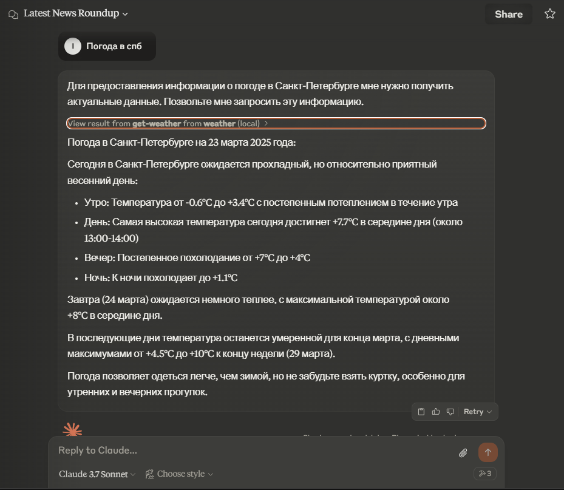

# Задача для собеседования - MCP сервер

Автор: Иван Ковачич

### Требования

- Node.js (не ниже версии 16)
- TypeScript

### Установка

Перейдите в директорию проекта:

```
npm i
```

Соберите проект:

```
npm run build
```


### Тестирование

Для интеграции с [Claude Desktop](https://claude.ai/download)

Отредактируйте файл (путь в Windows):
`%APPDATA%\Claude\claude_desktop_config.json`

Создайте или отредактируйте JSON-файл, чтобы он включал:

```json
{
  "mcpServers": {
    "interview-mcp": {
      "command": "node",
      "args": ["<ПУТЬ_К_ПАПКЕ_ВАШЕГО_ПРОЕКТА>\\build\\index.js"]
    }
  }
}
```

Переменная `<ПУТЬ_К_ПАПКЕ_ВАШЕГО_ПРОЕКТА>` — это путь в файловой системе к папке вашего загруженного проекта. Код сервера должен быть собран с помощью команды `npm run build`, и папка `build` должна существовать.


### Примеры (с Claude Desktop):

**Инструмент погоды**


**Инструмент курса обмена доллара**


**Инструмент новостной ленты**

